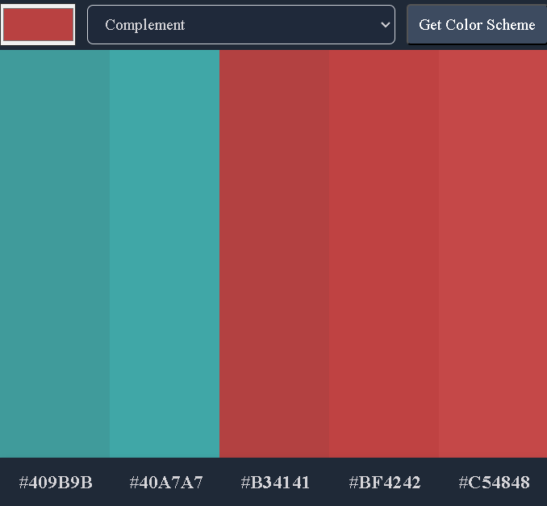

# ColorPicker
An app to find complimentary colors using REST Api to fetch color data based onuser's input. Built with HTML, CSS, JavaScript and REST Api. Styled based on a pre-built figma design.

Please view live demo at:
https://anibarro022.github.io/colorpicker/

